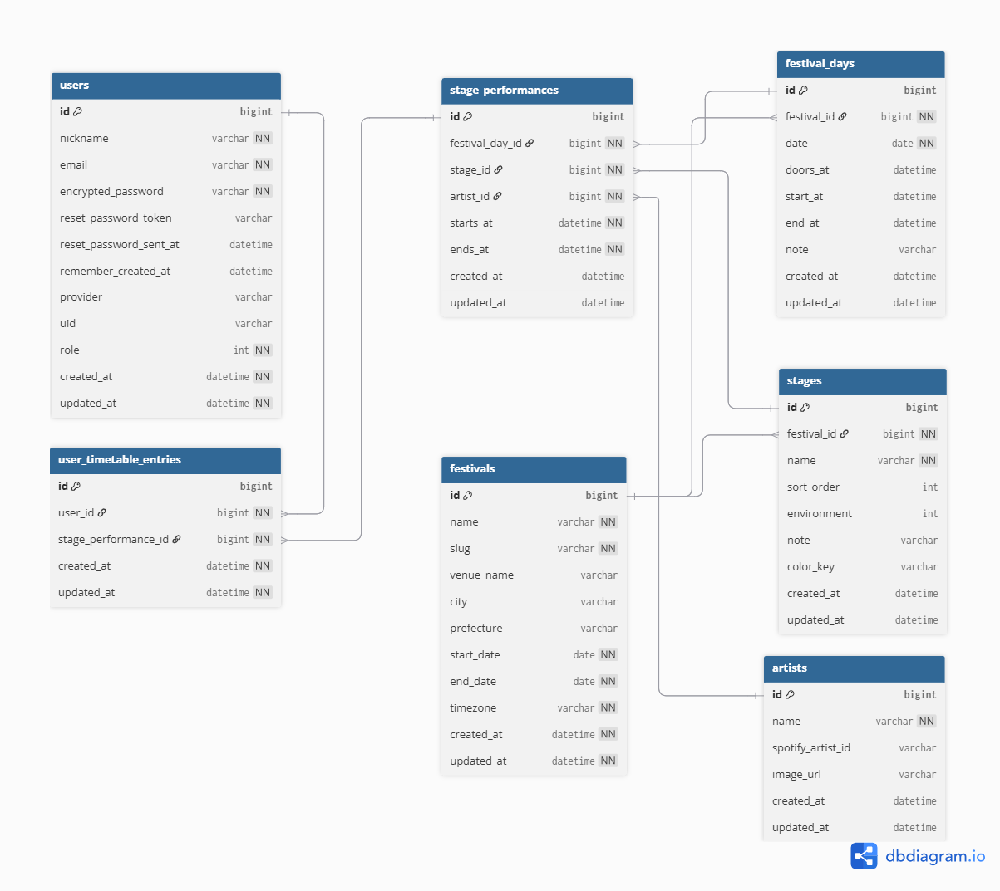
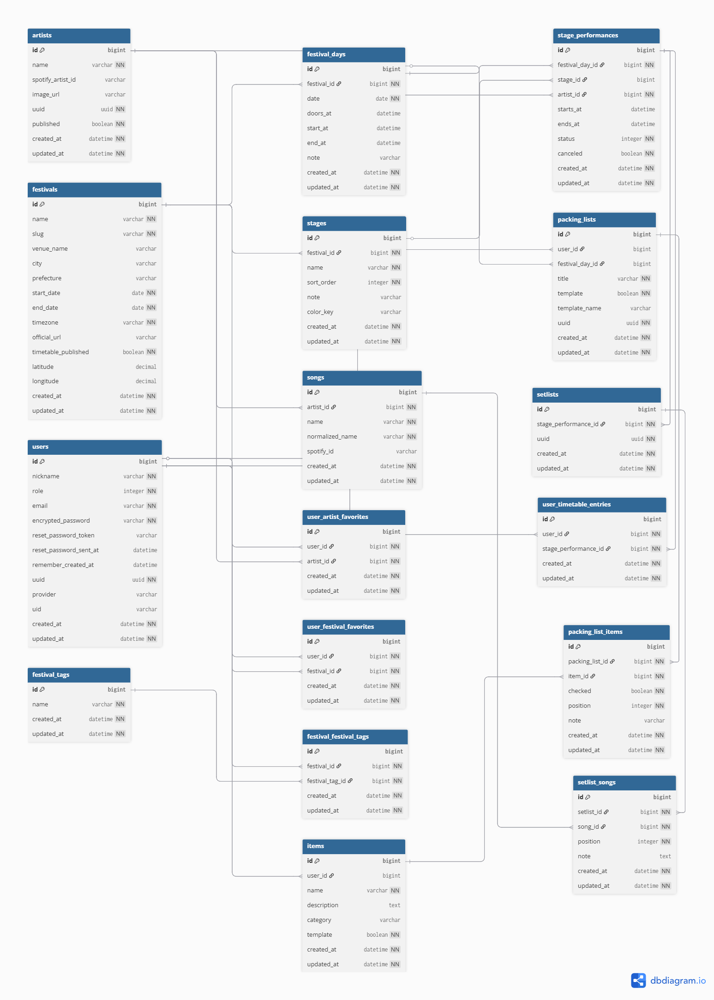

# **FES READY（フェス レディ）**

## **サービス概要**

「FES READY」は、音楽フェスに行く予定がある人の“準備と当日のスケジュール”をまとめて支えるアプリです。
音楽フェスに行く準備をする際に、タイムテーブルは公式アプリ、持ち物リストはスマホのメモ、予習は音楽サブスク、天気は天気アプリ…と必要な情報が分散している現状があります。FES READY はそれらを1つにまとめ、準備体験をシンプルにし、最高のフェス体験のサポートをするサービスです。

## **このサービスへの思い・作りたい理由**

はじめて音楽フェスに行ったとき、知らないアーティストの曲に次々と出会い、文字どおり“音楽の扉がひらく”体験をしました。そこからフェスが大好きになりました。一方で、初参加の人には不安が多いのも事実です。

例えば...
- 夏フェスの猛暑による熱中症対策
- 野外フェスの雨対策
- 冬の室内フェスでの寒暖差・服装管理
- 「どの曲を予習しておけば楽しめるか」がわからない問題

FES READY は、こうした不安をまとめて解消し、初めてでも迷わず準備ができて、当日を最大限楽しめる体験を届けるために作りたいと考えています。
タイムテーブル、持ち物、天気、楽曲の予習 etc...　バラバラな媒体から取得しがちな情報をひとつの場所に集約します。

また、現在は音楽サブスクの普及で、気になった曲をすぐ聴ける時代です。だからこそ「何を聴くかの指針」が価値になります。
FES READY では、過去フェスのセットリストを収集・分析し、各アーティストの “フェスで頻繁に演奏されている曲” をユーザーに提示します。
「この曲、知ってる！」という瞬間を増やし、初めての人でもライブの熱量に乗れるようにします。結果として、新しい音楽との出会いを広げることにつながるはずです。

――　これが、FES READY を作りたい理由です。初めての音楽フェスを、最高の入口に。

## **ユーザー層について**

- 音楽フェスに初めて参加する人
　理由：持ち物、楽曲予習などに不安がある人が多いため。

- 様々な媒体からの情報収集がめんどくさい人
　理由：フェスの準備に必要な情報収集がこのサービスで完結できるため。

## **サービスの利用イメージ**

1. 参加予定フェスを検索・選択し、「マイフェス」に追加  
2. 出演アーティストを確認し、観たいアーティストをお気に入り登録
3. アーティストごとの「頻出曲ランキング」や、フェスごとの予習リストを確認 → 効率的に予習
4. フェス当日のタイムテーブルから「マイタイムテーブル」を作成
5. フェス前日までに「持ち物チェックリスト」のテンプレートを「当日の天気情報」に合わせて選択し、準備の最終チェックを行う

## **サービスの差別化ポイント・推しポイント**

本サービスは、国内最大級の音楽フェス「ROCK IN JAPAN FESTIVAL」公式アプリ **「Jフェス」** という既存サービスと比較して、以下のような独自の強みがあります。

### 1. 過去のセットリストデータの活用
- **本サービス**：過去のフェスセトリから「演奏率の高い曲ランキング」を自動生成し、初心者でも予習すべき楽曲がひと目で分かる。  
- **Jフェス**：出演アーティストのタイムテーブルは確認可能だが、過去セトリや予習曲の提示は行っていない。

### 2. マイタイムテーブル作成・共有
- **本サービス**：自分専用のフェス当日スケジュールを簡単に作成でき、SNSでシェア可能（例：#フェスREADY）。友人同士でスケジュールを見せ合うことで交流が広がる。  
- **Jフェス**：マイタイムテーブルの作成機能はあるが、SNSシェアや外部連携は限定的。

### 3. フェス横断対応
- **本サービス**：複数の国内フェスに横断対応し、1つのアプリで「今年どのフェスに行くか」「複数フェスをどう予習するか」を管理可能。  
- **Jフェス**：対象フェスはROCK IN JAPAN FESTIVALやCOUNTDOWN JAPANなど一部フェスに限定。

### 4. Spotify連携による予習体験
- **本サービス**：出演アーティストの楽曲をSpotifyと連携し、ワンクリックで試聴・お気に入り登録が可能。Spotify無料アカウントでも利用可能。  
- **Jフェス**：アプリ内で音楽試聴機能はなく、外部サービスとの連携も限定的。

### 5. フェス初心者向けサポート（持ち物リスト）
- **本サービス**：フェス参加に必要な持ち物リストを利用・作成可能。当日の天気・気温を表示することで効率的なリスト作成が可能。  
- **Jフェス**：持ち物や準備に関するサポート機能はなし。ユーザー自身で調べる必要がある。

---

###  推しポイントまとめ
- **予習が楽になる**：「セトリ × Spotify」で初心者でも“この曲は聴いておくべき”がわかる。  
- **当日が楽しくなる**：「マイタイムテーブル × シェア」で予定の可視化と友達との交流が広がる。  
- **準備も安心**：「持ち物リスト × 天気連携」でフェス初心者でも安心して参戦できる。  
- **複数フェス対応**：1つのアプリで複数フェスを横断管理できる利便性。  

これにより、「Jフェス」が特定フェスに特化しているのに対して、**本サービスは“フェス全般を横断的に楽しむためのトータル予習・準備ツール”** である点が最大の差別化ポイントです。

## **主な機能一覧**

### 全てのユーザー
- フェス情報の検索・閲覧  
  - 基本情報（フェス名・日程・会場・タイムテーブル）  
  - 出演アーティスト一覧  
- アーティスト情報の検索・閲覧（Spotify連携）  
- 過去フェスのセットリストの閲覧（Spotify連携）
- フェス・アーティストごとの予習リストの閲覧・試聴（Spotify連携）

### 登録ユーザーのみ
- マイページの編集・閲覧
- マイタイムテーブル作成・SNSシェア（当日スケジュールを可視化・共有）
- マイプロフィール編集（ニックネーム変更など最小限）
- 持ち物チェックリスト機能（作成・編集）  
- 天気連携：天気 API（Open-Meteo）で日別・時間別の気温/降水を表示 
- お気に入り機能（お気に入りアーティスト・フェスを保存）

### 管理者ユーザーのみ
- ユーザー管理（一覧）  
- フェス情報管理（登録・編集・削除）  
- アーティスト情報管理（登録・編集・削除）  
- 出演枠情報管理（登録・編集・削除）
- 曲・セットリスト情報管理（登録・編集・削除）
- 持ち物・リストテンプレート情報管理（登録・編集・削除）

### 開発・運用
- RSpec によるテストを導入   
- rubocop によるRubyコードの静的解析を導入
- brakeman によるセキュリティ診断を導入

## **使用技術（暫定）**

- フロントエンド: Tailwind CSS  
- バックエンド: Ruby on Rails 8.0（Turbo / Stimulus）  
- データベース: PostgreSQL（Neon）  
- インフラ: Docker / Fly.io  
- 認証: Devise・Google認証
- 外部連携: Spotify API, Open-Meteo 

## **データ管理方針**

- フェス情報・出演アーティスト・過去セットリストは **管理者が手動で入力**    

## **最後に**

「フェスに行く前から、もう楽しい。」  
FES READY は、初めてのフェス参加者が不安を解消し、当日までのワクワク感を最大化するアプリです。  
すべての音楽好きが安心してフェスを楽しめるようにサポートします。  

## **画面遷移図**

https://www.figma.com/design/kpkzJnx15fiFkZp8c7443Y/FES-READY_%E7%94%BB%E9%9D%A2%E9%81%B7%E7%A7%BB%E5%9B%B3?node-id=0-1&t=9VuZg5rnCI83EjAK-1

## **ER図**

### **MVPリリースまで**

### **本リリースまで**
